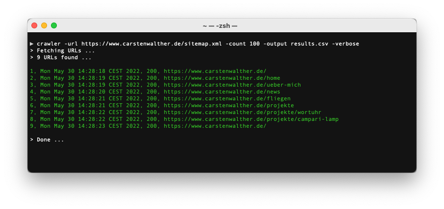

# Simple CLI sitemap crawler

Crawler is a command line tool for crawling xml sitemaps, see [https://www.sitemaps.org/](https://www.sitemaps.org/).

## Requirements

You have to install Go programming language. Also you have to install upx for packaging the binaries.

## Compiling

Just run `make all`. All binaries were build into the build folder.

## Installing

Once you build the binaries. Copy the desired binary depending on your operating system to `/usr/local/bin/`. You should rename it to a simpler filename like `crawler`. Also you can use the `make install` command.

## Running

Crawler uses 4 parameters:

| Parameter | Type | Description | Default |
|:---|:---|:---|:---|
| url | string | the URL to your sitemap.xml |  |
| output | string | write results to a csv file |  |
| count | int | max count of URLs to crawl | 0, means disabled |
| verbose | bool | show verbose output | false |

Run example:

```bash
$ crawler -url https://www.carstenwalther.de/sitemap.xml -count 100 -output results.csv -verbose
```

Console output:

